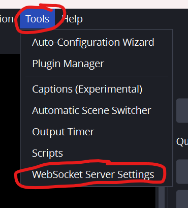
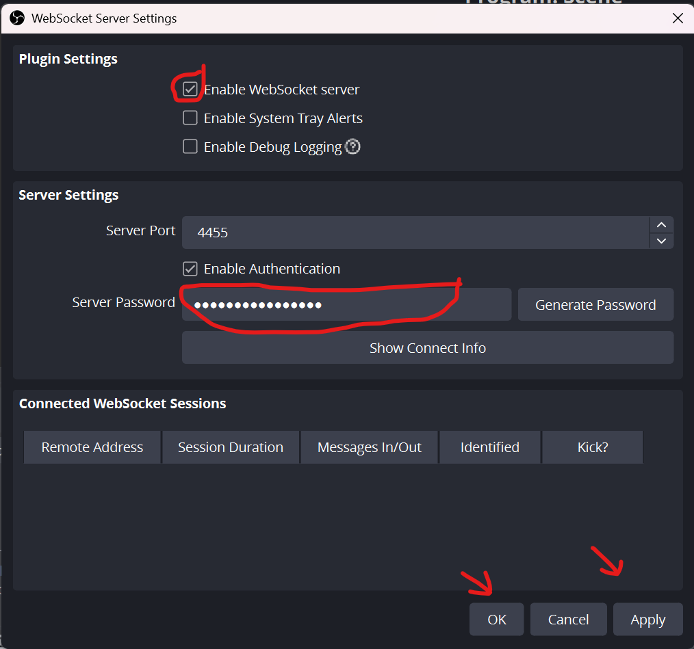
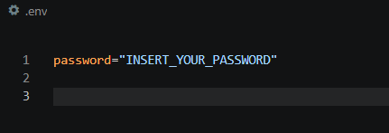
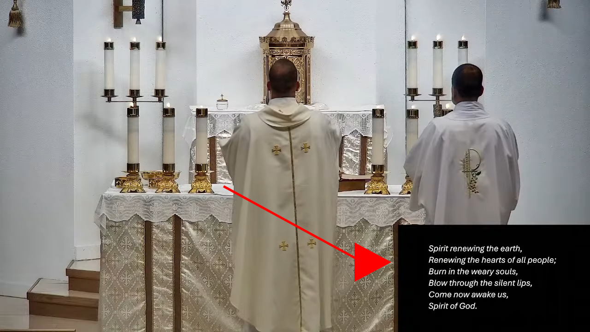
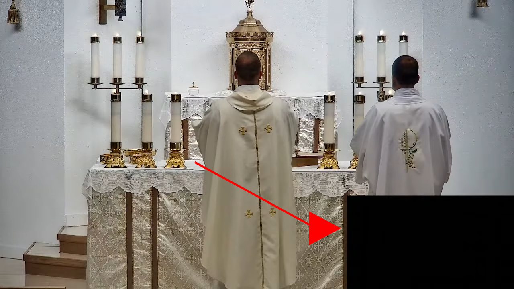

# Livestreaming-VoidWatch


## Setup
In OBS, Non-Safe Mode, Select Tools --> WebSocket Server Settings



On This page, Select enable WebSocket Server, also go ahead and copy the server password, then hit apply and ok.



In an .env file that you will create, paste the password you previously copied.



Finally Locate these lines

```py
SLIDES = "Target Element" # Source element that will be hidden/unhidden
VIEWER = "Slides" # Monitoring Source
```

Replace Target element with the source that you want VoidWatch to Control

Replace Slides with the source you want VoidWatch to Monitor

## The Problem

While livestreaming, the Powerpoint link can sometimes be faster than the reaction time of the streamer. This causes there to be a black square on the bottom of the screen for several seconds. Alternatively, the streamer may forget to turn on the Powerpoint for the live viewers.

VoidWatch refreshes every 0.2 seconds, checking a specific view to see if the slides are blank or not. Enabling the computer to automatically change the slides faster than a human can.



